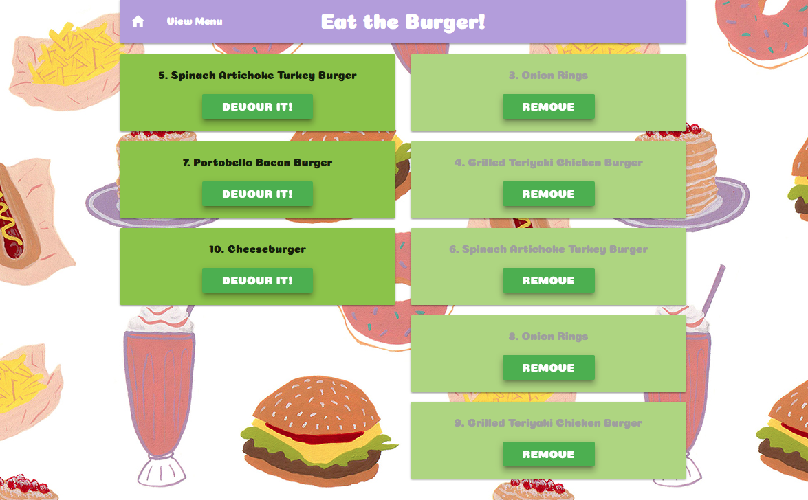
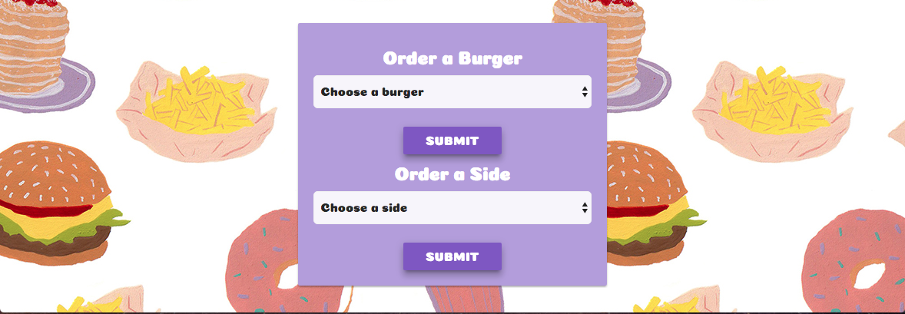

# Eat the Burger!
Eat-Da-Burger! is a restaurant app that lets users select burgers or sides from a menu that they'd like to eat.

Whenever a user submits a burger's or side's name, the app will display the burger or side on the left side of the page -- waiting to be devoured.

Each burger or side in the waiting area also has a Devour it! button. When the user clicks it, the burger or side will move to the right side of the page.

The app will store every burger or side in a database, whether devoured or not.

## NPM Packages
- Handlebars - http://handlebarsjs.com/
- Body-parser - https://www.npmjs.com/package/inquirer
- Express - https://www.npmjs.com/package/express
- Mysql - https://www.npmjs.com/package/mysql
- Handlebars - https://www.npmjs.com/package/handlebars
- Express-handlbars - https://www.npmjs.com/package/express-handlebars

## Built With
* Node
* Visual Studio Code
* Materialize
* Sequel Pro

## Screen Shots

### Index Page

### Form to create new burgers or sides to 'devour' from drop down menus

### Menu Page - Displays all available Burgers and Sides

