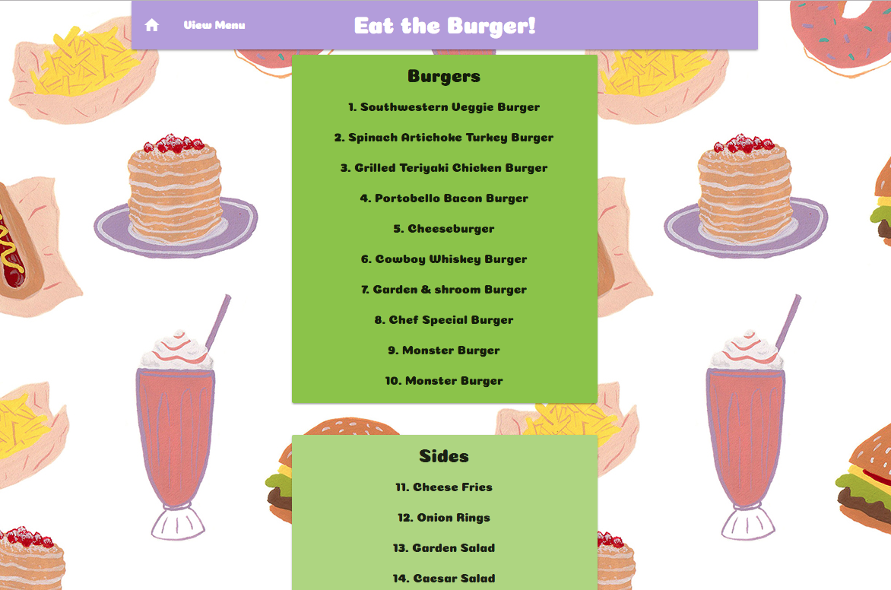

# Eat the Burger!

## NPM Packages
- Handlebars - http://handlebarsjs.com/
- Body-parser - https://www.npmjs.com/package/inquirer
- Express - https://www.npmjs.com/package/express
- Mysql - https://www.npmjs.com/package/mysql
- Handlebars - https://www.npmjs.com/package/handlebars
- Express-handlbars - https://www.npmjs.com/package/express-handlebars

## Built With
* Node
* Visual Studio Code
* Materialize
* Sequel Pro

## Screen Shots

### Index Page

### Form to create new burgers or sides to 'devour' from drop down menus

### Menu Page - Displays all available Burgers and Sides

